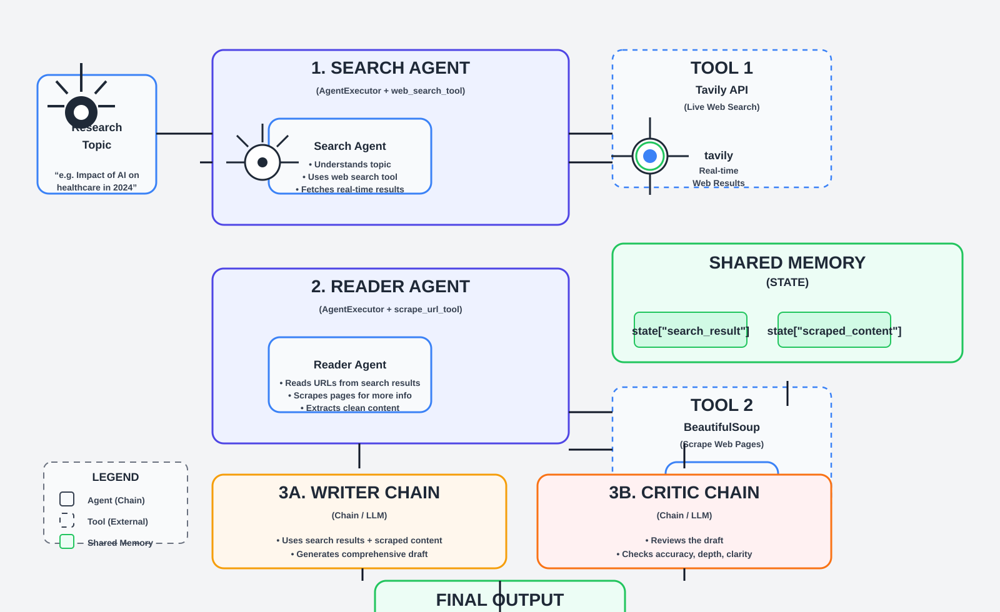

# ResearchForge AI

A multi-agent research system that searches the web, scrapes the best source, writes a structured research report, and then criticizes the draft before returning the final answer.



## Overview

This project uses a small team of specialized AI agents:

- Search Agent: finds recent and relevant sources
- Reader Agent: opens the best links and scrapes readable content
- Writer Chain: turns research into a professional report
- Critic Chain: reviews the output and gives feedback

The system is built with Python, LangChain, Tavily, BeautifulSoup, and Mistral.

## Architecture

The workflow is:

1. User gives a research topic
2. Search Agent uses Tavily to find live web results
3. Reader Agent picks the most relevant URL and scrapes page content
4. Writer Chain combines research + scraped content and creates a report
5. Critic Chain reviews the report for clarity, depth, and correctness
6. Final output is returned to the user

## Project Structure

```text
.
├── agents.py
├── pipeline.py
├── tools.py
├── requirements.txt
├── .env
├── notes.txt
├── Project/
│   ├── ARCHITECTURE.md
│   ├── STEPS.md
│   └── WORKFLOW.md
├── assets/
│   └── researchforge-architecture.svg
├── .gitignore
├── README.md
└── .venv/
```

## Features

- Live internet search using Tavily
- Web scraping with BeautifulSoup
- Agent-driven research workflow
- Writer and critic chain for structured output
- Shared state for passing data between steps
- Simple Python project setup

## Tech Stack

- Python
- LangChain
- LangGraph-style agent flow
- Tavily API
- BeautifulSoup
- Mistral AI
- Python dotenv

## Setup

1. Clone the project
2. Create a virtual environment
3. Install dependencies
4. Add your API keys in a `.env` file

```bash
python -m venv .venv
source .venv/bin/activate   # Linux/Mac
.venv\Scripts\activate      # Windows
pip install -r requirements.txt
```

Create a `.env` file:

```env
TAVILY_API_KEY=your_tavily_api_key
MISTRAL_API_KEY=your_mistral_api_key
```

## Run the Pipeline

```bash
python pipeline.py
```

Then enter a topic when prompted.

## Example

```text
Enter a Research Topic: Impact of AI on healthcare in 2024
```

The system will:

- search recent sources
- read the best source
- create a detailed report
- review the report for quality

## Notes

This project is designed as a lightweight research assistant demo and can be extended with:

- more scraping tools
- better resource ranking
- multi-source synthesis
- PDF or CSV export
- web UI or API layer

## License

This project is intended for educational and research use.
