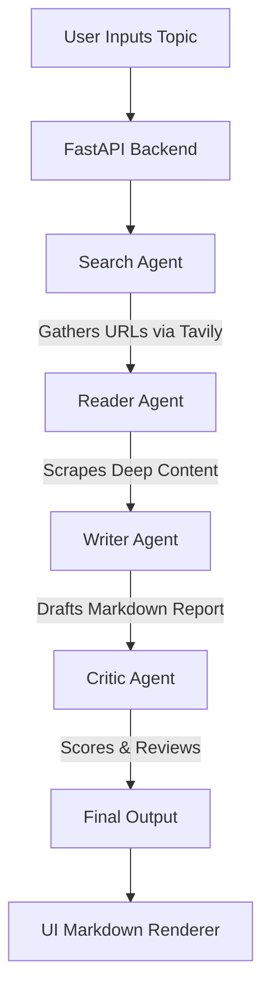

<div align="center">

# 🧠 ResearchMind

### Multi-Agent Pipeline for Autonomous Deep Web Research

<p>
An autonomous AI system that leverages multiple specialized agents to search, scrape, write, and critique detailed research reports on any topic.<br/>
Powered by LangChain, LangGraph, Mistral AI, Tavily, and FastAPI.
</p>

<br/>


<p>
  <a href="#-installation">Installation</a> •
  <a href="#-how-it-works">How It Works</a> •
  <a href="#%EF%B8%8F-tech-stack">Tech Stack</a> •
  <a href="#-roadmap">Roadmap</a> •
  <a href="#-contributing">Contributing</a>
</p>

</div>

---

## 🌟 Overview

**ResearchMind** automates the tedious process of deep web research. 

Instead of relying on a single LLM to generate generic answers, ResearchMind deploys a **Multi-Agent Pipeline** where specialized AI agents collaborate. One agent searches the web, another scrapes the most relevant links for deep context, a writer drafts a comprehensive report, and a critic reviews and scores it.

The current release, **v1.0.0**, features a complete asynchronous FastAPI backend that streams the agents' thoughts in real-time to a beautiful, modern, and highly dynamic glassmorphism web UI.

---

## ✨ Features

| | |
|---|---|
| **Multi-Agent Collaboration** | Search, Reader, Writer, and Critic agents working in unison |
| **Real-Time Streaming UI** | Server-Sent Events (SSE) stream terminal logs directly to the frontend |
| **Dynamic Visual Pipeline** | A beautiful horizontal UI that animates as each agent activates |
| **Web Search & Scraping** | Uses Tavily Search API and BeautifulSoup for grounded, up-to-date data |
| **Mistral AI Integration** | High-quality analysis and report drafting |
| **Instant Markdown Rendering** | Final reports and critic scores are instantly formatted in the browser |
| **Raw Data Access** | View the exact scraped content and search results the agents used |

---

## 🏗️ System Architecture

<details>
<summary><b>View as Mermaid flowchart</b></summary>



</details>

---

## ⚙️ Tech Stack

| Component | Technology |
|---|---|
| Language | Python 3.11+ |
| Framework | LangChain & LangGraph |
| LLM | Mistral AI |
| Search API | Tavily Search |
| Web Scraping | BeautifulSoup4 |
| Backend API | FastAPI & Uvicorn |
| Frontend | HTML5, CSS3 (Glassmorphism), Vanilla JS |
| Markdown Parsing | Marked.js |

---

## 📂 Project Structure

```text
ResearchMind/
│
├── main.py                  # FastAPI server & SSE streaming
├── pipeline.py              # Orchestrates the Multi-Agent flow
├── agents.py                # Defines the LangChain/LangGraph agents
├── tools.py                 # Tavily search and custom scraping tools
├── requirements.txt         # Project dependencies
├── .env                     # API Keys (Mistral, Tavily)
├── README.md
│
└── ui/                      # Vanilla Web Frontend
    ├── index.html           # Main dashboard
    ├── styles.css           # Premium dark theme styling
    └── app.js               # Dynamic agent animations & SSE reader
```

---

## 🚀 Installation

```bash
# 1. Clone the repository
git clone https://github.com/kanishkk-gupta/ResearchMind-Multi-Agent-Pipeline.git
cd ResearchMind-Multi-Agent-Pipeline

# 2. Install dependencies
pip install -r requirements.txt
```

### Environment Variables

Create a `.env` file in the project root:

```env
MISTRAL_API_KEY=your_mistral_api_key
TAVILY_API_KEY=your_tavily_api_key
```

### Run

```bash
uvicorn main:app --reload
```

Then open your browser and navigate to:
**http://localhost:8000/ui**

---

## 🧠 How It Works

ResearchMind runs a **four-stage** intelligent workflow:

### 1. Search Agent
Takes the user's topic and queries the web using the **Tavily API** to find the most recent, relevant links and summaries.

### 2. Reader Agent
Acts as a deep researcher. It analyzes the search results, picks the most promising URL, and uses **BeautifulSoup** to scrape the raw text, filtering out ads and noise.

### 3. Writer Chain
Synthesizes the search summaries and the deep scraped content to draft a highly structured, comprehensive Markdown report.

### 4. Critic Chain
An independent evaluator that reviews the Writer's draft against strict criteria (depth, clarity, structure) and assigns a final score (out of 100).

*The entire process is orchestrated synchronously in Python, while `main.py` captures the terminal output and streams it via **Server-Sent Events (SSE)** to the Javascript frontend to drive the real-time UI animations!*

---

## 🗺️ Roadmap

- [x] **v1.0.0** - Core agents, Tavily integration, Mistral LLM, dynamic HTML/CSS UI, FastAPI streaming
- [ ] **v1.1.0** - Add multi-URL scraping capabilities for the Reader Agent
- [ ] **v1.2.0** - Implement human-in-the-loop approval before final report generation
- [ ] **v2.0.0** - Persistent SQLite/PostgreSQL database to save and share past research reports

---

## 🤝 Contributing

Contributions, issues, and feature requests are welcome!

1. Fork the repository
2. Create a feature branch
3. Commit your changes
4. Open a Pull Request

---

## 📄 License

Licensed under the **MIT License**.

---

## 🙏 Acknowledgements

Built on the excellent open-source ecosystem provided by **LangChain**, **LangGraph**, **Mistral AI**, and **FastAPI**.

---

## ✍️ Author

**Kanishk Gupta**  
Computer Science Engineering undergraduate with a strong interest in Generative AI, LLMs, AI Engineering, and Full-Stack Development.

[GitHub](https://github.com/kanishkk-gupta) · [LinkedIn](https://linkedin.com/in/kanishkgupta16)

---

<div align="center">

### ⭐ If you found this project useful, consider giving it a star — it helps others discover it!

Made with ❤️ using LangChain • Mistral AI • FastAPI

</div>
